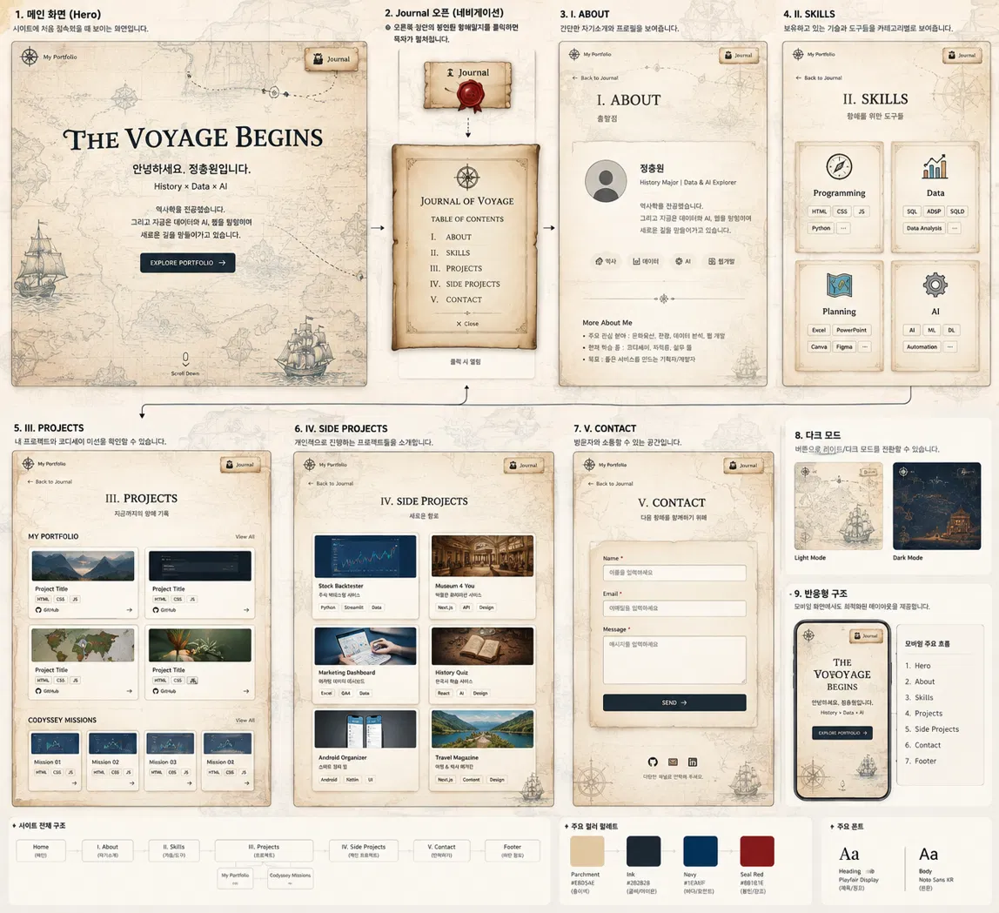

# Personal Portfolio — The Voyage Begins

역사학을 바탕으로 AI·데이터와 웹 기술을 학습하며 탐험 기록을 정리하는 개인 포트폴리오입니다.

## Mission 01
HTML, CSS, JavaScript를 사용해 웹의 기본 원리와 프론트엔드 기초를 학습하며 단계적으로 구축했습니다.

## Tech Stack
- HTML5
- CSS3
- Vanilla JavaScript (ES6+)
- Git / GitHub / GitHub Pages

## 주요 기능
- 반응형 Hero / About / Skills / Projects / Contact / Footer
- 모바일 Journal(햄버거) 메뉴
- 부드러운 앵커 스크롤
- 300px 이후 Scroll Top 버튼
- 60px 이후 Header 스타일 변화
- Light / Dark Mode + localStorage 상태 유지
- Intersection Observer 기반 스크롤 등장 애니메이션
- Hero 타이핑 효과
- Contact 폼 필수값·이메일 형식 검증 및 input/submit UX
- GitHub API 기반 저장소 동적 렌더링
- GitHub API 로딩 / 성공 / 에러 / 빈 상태 처리
- GitHub 저장소 언어별 필터링

## Deployment
GitHub Pages: https://ewisewjd.github.io/

## Reference Design
역사 지도와 항해 일지를 모티브로 한 파치먼트 스타일을 적용했습니다.

## Mission Constraints
React, Vue, jQuery, Bootstrap, Tailwind CSS 등 외부 라이브러리는 사용하지 않고 순수 HTML/CSS/JavaScript로 구현했습니다.
Google Fonts는 미션에서 허용된 웹 폰트 범위에서 사용합니다.

## Interaction 기준
- Header 스타일 변경: scrollY > 60px
- Scroll Top 표시: scrollY > 300px
- Intersection Observer threshold: 0.2
